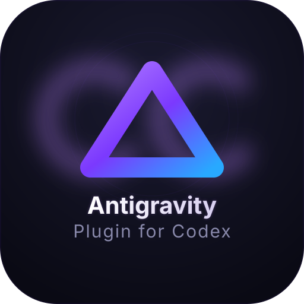

<p align="center">
  
</p>

<h3 align="center">Antigravity (agy) Plugin for Codex</h3>

<p align="center">
  Run Gemini reviews, rescue tasks, and tracked background work from inside Codex via the Antigravity CLI.
</p>

<p align="center">
  <code>agy-plugin-codex</code> runs inside Codex and lets you use Gemini (through the local <code>agy</code> binary) for review, rescue, and tracked background workflows — no API keys, using your Google AI Pro subscription.
</p>

<p align="center">
  <a href="#quick-start"><strong>Quick Start</strong></a> ·
  <a href="#commands"><strong>Commands</strong></a> ·
  <a href="#background-jobs"><strong>Background Jobs</strong></a> ·
  <a href="#review-gate"><strong>Review Gate</strong></a> ·
  <a href="https://github.com/seankoji-com/agy-plugin-codex/issues"><strong>Issues</strong></a>
</p>

---

## What Is This?

`agy-plugin-codex` turns Codex into a host for Antigravity work.
**Codex stays in charge of the thread. Antigravity (Gemini) does the review and rescue work.**

Execution goes entirely through the local, pre-authenticated `agy` binary. There are no API keys to configure — the plugin consumes whatever Google AI Pro quota your Antigravity login has.

You get seven commands (`$agy:review`, `$agy:adversarial-review`, `$agy:rescue`, `$agy:status`, `$agy:result`, `$agy:cancel`, `$agy:setup`) that launch tracked Antigravity work, manage lifecycle and ownership, and surface results back into Codex.

That includes:
- Built-in Codex subagent orchestration for rescue and background review flows
- Session-scoped tracked jobs with status, result, and cancel commands
- Background completion nudges that steer you to the right `$agy:result <job-id>`
- An optional turn-end review gate with an `ALLOW:`/`BLOCK:` contract and the §6.1 rubric
- GitHub CI coverage on Windows, macOS, and Linux

This is a port of [sendbird/cc-plugin-codex](https://github.com/sendbird/cc-plugin-codex), which itself follows the shape of [openai/codex-plugin-cc](https://github.com/openai/codex-plugin-cc) — but runs in the opposite direction and targets Antigravity instead of Claude Code.

## Quick Start

### 1. Install

From this repository:

```bash
codex plugin add seankoji-com/agy-plugin-codex
```

Then run `$agy:setup` once.

The optional `npx` helper runs the same install path and enables the required Codex feature gates:

```bash
npx agy-plugin-codex install
```

On Windows, prefer the marketplace path or the `npx` helper. The shell-script helper below is POSIX-only.

> **Prerequisites:** Node.js 18+, Codex with hook support, and the `agy` CLI installed and authenticated.
> If you don't have the Antigravity CLI yet, install it with the official installer and complete Google sign-in once:
> ```bash
> curl -fsSL https://antigravity.google/cli/install.sh | bash
> agy
> ```

### 2. Verify

Open Codex and run:

```text
$agy:setup
```

All checks should pass. If any fail, `$agy:setup` tells you what to fix.
If setup adds the marketplace-qualified plugin-data root and legacy migration roots to the writable-root list, restart Codex and rerun the same command; a requested review-gate toggle waits for that restart.

### 3. Try It

```text
$agy:review --background
```

That launches an Antigravity review from a Codex-managed background flow. You can check on it immediately:

```text
$agy:status
$agy:result
```

When it finishes, Codex should nudge you toward the right result. If not, `$agy:status` and `$agy:result` are always the fallback.

## Commands

| Command | What It Does |
| --- | --- |
| `$agy:review` | Read-only Antigravity (Gemini) review of your changes |
| `$agy:adversarial-review` | Design-challenging review — questions approach, tradeoffs, hidden assumptions |
| `$agy:rescue` | Hand a task to Antigravity — bugs, fixes, investigations, follow-ups |
| `$agy:status` | List running and recent Antigravity jobs, or inspect one job |
| `$agy:result` | Open the output of a finished job |
| `$agy:cancel` | Cancel an active background job |
| `$agy:setup` | Verify installation, auth, hooks, and review gate |

Quick routing rule:
- Use `$agy:review` for straightforward correctness review of the current diff.
- Use `$agy:adversarial-review` for riskier config/template/migration/design changes, or whenever you want stronger challenge on assumptions and tradeoffs.
- Use `$agy:rescue` when you want the delegated model to investigate, validate by changing code, or actually fix/implement something.

### `$agy:review`

Standard read-only review of your current work.

```text
$agy:review                          # review uncommitted changes (default: flash-medium)
$agy:review --base main              # review branch vs main
$agy:review --scope branch           # explicitly compare branch tip to base
$agy:review --background             # run in background, check with $agy:status later
$agy:review --model flash-high       # switch to high-effort flash
```

**Flags:** `--base <ref>`, `--scope <auto|working-tree|branch>`, `--wait`, `--background`, `--model <model>`, `--effort <low|medium|high>`

**Defaults:** model `flash-medium` (resolved to `gemini-3.8-flash-medium`), and no effort at all. After trimming surrounding whitespace, the friendly aliases `flash-low`, `flash-medium`, and `flash-high` map to their catalog IDs; every other `--model` value passes through unchanged for agy to resolve, including full model IDs and provider-specific names. `--effort` is forwarded only when you pass it, so each model keeps whatever effort agy defaults to. Antigravity owns which effort levels each model supports.

**Model discovery:** run `agy models` to see the models and effort levels available to your current account and provider, then pass the selected alias or full ID to this plugin. The plugin intentionally does not maintain a static model catalog or a per-model effort table; Antigravity owns alias versions, supported effort levels, managed restrictions, provider routing, and extended-context eligibility.

Scope `auto` (the default) inspects `git status` and chooses between working-tree and branch automatically.

In foreground, review returns the result directly. In background, the plugin uses a Codex built-in subagent, tracks the review as a job, and nudges you to open the result when it completes.

If the diff is too large to inline safely, the review prompt falls back to concise status/stat context and tells the model to inspect the diff directly with read-only `git diff` commands instead of failing the run.

### `$agy:adversarial-review`

Same as `$agy:review`, but steers the delegated model to challenge the implementation — tradeoffs, alternative approaches, hidden assumptions.

```text
$agy:adversarial-review
$agy:adversarial-review --background question the retry and rollback strategy
$agy:adversarial-review --base main challenge the caching design
```

Accepts the same flags as `$agy:review`, plus free-text focus after flags to steer the review.

Background adversarial review uses the same tracked built-in subagent pattern as `$agy:review`.

### `$agy:rescue`

Hand a task to Antigravity. This is the main way to delegate real work — bug fixes, investigations, refactors.

```text
$agy:rescue investigate why the tests started failing
$agy:rescue fix the failing test with the smallest safe patch
$agy:rescue --resume apply the top fix from the last run
$agy:rescue --background investigate the regression
$agy:rescue --model flash-high --effort medium investigate the flaky test
```

**Flags:**

| Flag | Description |
| --- | --- |
| `--background` | Run in background; check later with `$agy:status` |
| `--wait` | Run in foreground |
| `--resume` | Continue the most recent Antigravity conversation |
| `--resume-last` | Alias for `--resume` |
| `--fresh` | Force a new task (don't resume) |
| `--write` | Allow file edits (default) |
| `--model <model>` | Any agy model alias or full model ID; defaults to `flash-medium`. Run `agy models` to discover options available to your account and provider. |
| `--effort <level>` | Reasoning effort: `low`, `medium`, `high`. Unset by default, so the model keeps agy's own effort default. |
| `--prompt-file <path>` | Read task description from a file |

**Resume behavior:** If you don't pass `--resume` or `--fresh`, rescue checks for a resumable Antigravity conversation and asks once whether to continue or start fresh. Your phrasing guides the recommendation — "continue the last run" → resume, "start over" → fresh. `task --write` runs with agy `--mode accept-edits`; without `--write` it stays read-only in `--mode plan`.

### `$agy:status`

```text
$agy:status                          # list active and recent jobs
$agy:status task-abc123              # detailed status for one job
$agy:status --all                    # show all tracked jobs in this repository workspace
$agy:status --wait task-abc123       # block until job completes
```

By default, `$agy:status` shows jobs owned by the current Codex session. Use `--all` when you want the wider repository view across older or sibling sessions in the same workspace.

### `$agy:result`

```text
$agy:result                          # open the latest finished job for this session/repo
$agy:result task-abc123              # show finished job output
```

When a job came from a built-in background child, the output can show both:
- the **Antigravity conversation** you can resume with `agy --conversation ...`
- the **Owning Codex session** that owns the tracked job inside Codex

To reopen the Antigravity conversation directly:

```bash
agy --conversation <conversation-id>
```

### `$agy:cancel`

```text
$agy:cancel task-abc123              # cancel a running job
```

### `$agy:setup`

```text
$agy:setup                           # verify everything
$agy:setup --enable-review-gate      # turn on turn-end review gate
$agy:setup --disable-review-gate     # turn it off
```

Setup checks Antigravity CLI availability, native plugin hook feature gates, and review-gate state. If the Antigravity CLI isn't installed, it offers to install it via the official installer.
This is also the repair path for marketplace-installed copies of the plugin: `$agy:setup` confirms `[features].hooks = true`, trusts this plugin's current native hook hashes, and allows sandboxed writes to Codex's injected marketplace-qualified plugin-data root plus the legacy roots needed for one-time migration. If those writable roots were just added, restart Codex and rerun setup before changing the review gate.

## Background Jobs

All review and rescue commands support `--background`. Background jobs are tracked per-session with full lifecycle management:

1. **Queued → Running → Completed** — jobs progress through states automatically.
2. **Built-in subagent background flows** — background rescue, review, and adversarial review use Codex-managed subagent turns rather than stuffing `--background` into the companion command itself.
3. **Completion nudges** — when a background built-in flow finishes, the plugin tries to nudge the parent thread with the right `$agy:result <job-id>`. If that nudge cannot surface cleanly, unread-result hooks are the backstop.
   The nudge is intentionally just a pointer. The actual stored result still opens through `$agy:result`.
4. **Unread-result fallback** — when you submit your next prompt after a finished unread job, Codex can remind you that a result is waiting and point you to `$agy:status` / `$agy:result`.
5. **Session ownership** — jobs stay attached to the user-facing parent Codex session even when a built-in rescue/review child does the actual work, so plain `$agy:status`, `$agy:result`, and resume-candidate detection still follow the parent thread.
6. **Cleanup on exit** — when your Codex session ends, any still-running detached jobs are terminated via PID identity validation, and stale reserved job markers are cleaned up over time.

**Typical background flow:**

```text
$agy:rescue --background investigate the performance regression
# ... keep working ...
# Codex nudges with the exact result command when possible
$agy:result task-abc123
```

### What “background” means here

- The parent Codex thread does not wait.
- The agy companion command still runs in the foreground inside its own worker/subagent thread.
- For rescue and background review flows, the plugin prefers Codex built-in subagents and only uses job polling/status commands as the durable backstop.

## Review Gate

The review gate is an **optional turn-end hook**. When enabled, Codex runs an Antigravity review of the last Codex response before the turn is allowed to finish.

- The review returns `ALLOW:` → the turn finishes normally.
- The review returns `BLOCK:` → the turn is blocked; Codex continues with the review feedback.

The gate follows the §6.1 rubric: `BLOCK:` is returned **only** for definite runtime exceptions or fatal unhandled edge cases, syntax errors or broken imports, severe security vulnerabilities, or explicit regressions against existing tests — never for style, naming, or optional refactoring. Service-limit and rate-limit failures fail open (treated as `ALLOW:` with a warning) so a quota error cannot wedge your turn.

**Caveats:**

- **Disabled by default.** Enable with `$agy:setup --enable-review-gate`.
- **Uses your agy defaults.** The gate does not pass `--model` or `--effort`; set your preferred default in agy if you want the gate to use a specific model or effort level.
- **Token cost.** Every edit-producing turn can trigger an agy invocation. This can drain usage limits quickly in active coding sessions.
- **Timeout.** The gate has a hard timeout. If agy doesn't respond, the turn remains blocked and the error points you to a manual review.
- **Skip-on-no-edits.** The gate computes a working-tree fingerprint baseline and skips review when the last Codex turn made no net edits.
- **Not in nested sessions.** Child sessions (e.g., rescue subagents) suppress the gate to avoid feedback loops.

**Only enable when you're actively monitoring the session.**

## Install Variants

### Marketplace

```bash
codex plugin marketplace add seankoji-com/agy-plugin-codex
```

Then run:

```text
$agy:setup
```

Marketplace/plugin install places the plugin under Codex's plugin cache. `$agy:setup` verifies the Antigravity CLI, confirms `[features].hooks = true`, and trusts the current `hooks/hooks.json` hook hashes from the active plugin cache.

### npx helper

```bash
npx agy-plugin-codex install
```

After install, run:

```text
$agy:setup
```

### Shell script (POSIX-only)

```bash
curl -fsSL "https://raw.githubusercontent.com/seankoji-com/agy-plugin-codex/main/scripts/install.sh" | bash
```

After install, run:

```text
$agy:setup
```

### Update

Re-run the marketplace update/install flow or the `npx` helper — both are idempotent.

```bash
npx agy-plugin-codex update
```

### Uninstall

```bash
npx agy-plugin-codex uninstall
```

## Troubleshooting

**`$agy:setup` reports the Antigravity CLI not found**
```bash
curl -fsSL https://antigravity.google/cli/install.sh | bash
agy
```

**Commands not recognized in Codex**
Re-run install and restart Codex. This plugin expects Codex plugin support and no longer installs local skill-wrapper fallbacks.

**Hooks not firing**
Check that `hooks = true` is set in `~/.codex/config.toml` under `[features]`. Run `$agy:setup` to verify and auto-repair the feature gate plus this plugin's hook trust hashes, then restart Codex if that flag was just changed.

**A background job finished but I did not get the result nudge**
Use:
```text
$agy:status
$agy:result
```
The built-in notify path is best-effort. The tracked job store and unread hook remain the reliable fallback.

If you think the job may belong to an older session in the same repository, use:
```text
$agy:status --all
```

If a finished result shows both an **Antigravity conversation** and an **Owning Codex session**, use the Antigravity conversation for `agy --conversation ...`. The owning session is there only to explain which Codex thread owns the tracked job.

**Large review diff caused a failure or was omitted**
That is expected on very large diffs. The plugin now degrades to a compact review context and points the model toward read-only `git diff` commands instead of trying to inline everything. If you want the full picture, run a narrower review such as:
```text
$agy:review --base main
$agy:review --scope working-tree
```

**Review gate draining tokens**
Disable it: `$agy:setup --disable-review-gate`. The gate can fire after every edit-producing turn, which adds up.

**Background jobs not cleaned up**
Jobs are terminated when the Codex session that owns them exits. If a session crashes without cleanup, use `$agy:status` and `$agy:cancel <job-id>` to clean up any leftovers.

## License

[Apache-2.0](LICENSE) — see [NOTICE](NOTICE) for attribution.
